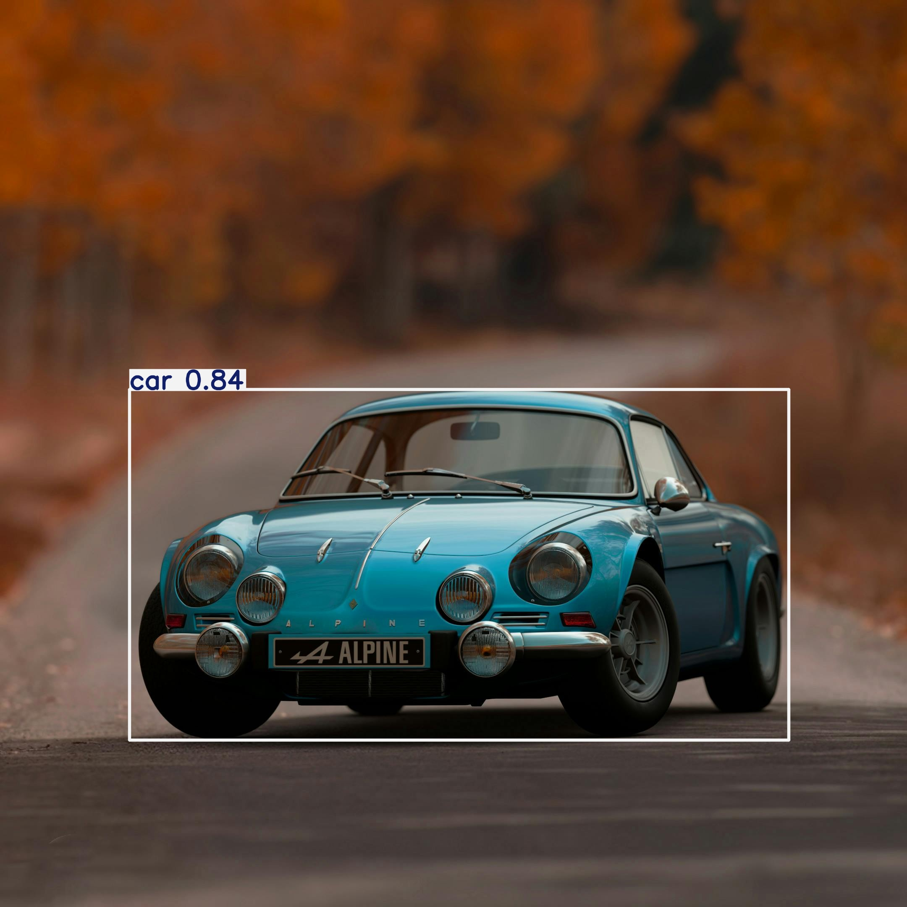

```md
# 🦾 YOLOv8 Object Detection Demo

This beginner-friendly project demonstrates how to perform object detection on local images using [Ultralytics YOLOv8](https://github.com/ultralytics/ultralytics). It includes both a Jupyter Notebook for interactive experimentation and a command-line script for quick testing.

---

## 📁 Project Structure

```

object-detection-yolov8-demo/
├── notebooks/
│   └── yolov8\_demo.ipynb       # Main notebook
├── images/
│   ├── input/                  # Raw input images
│   └── output/                 # Detection results (auto-saved)
├── models/                     # Optional model exports
├── src/
│   └── test\_custom\_image.py    # Command-line detection script
├── requirements.txt
├── README.md
└── .venv/                      # Virtual environment (not tracked)

````

---

## 🚀 Getting Started

### 1. Clone the Repository

```bash
git clone https://github.com/your-username/object-detection-yolov8-demo.git
cd object-detection-yolov8-demo
````

### 2. Create & Activate a Virtual Environment

```bash
# Create venv
python -m venv .venv

# Activate it
# Windows:
.venv\Scripts\activate

# macOS/Linux:
source .venv/bin/activate
```

### 3. Install Dependencies

```bash
pip install -r requirements.txt
```

---

## 💻 Run with Jupyter Notebook

1. Launch Jupyter Notebook in VS Code or browser:

```bash
jupyter notebook
```

2. Open:

```
notebooks/yolov8_demo.ipynb
```

3. Add your test image(s) to:

```
images/input/
```

4. Run the cells to detect and visualize output.

---

## 🛠️ Run from Command Line (CLI)

```bash
python src/test_custom_image.py images/input/sample1.jpg --show
```

### Options:

* `--show`: Display the output image in a resizable pop-up window.

> Output images will be saved in `images/output/` by default.

---

## 📦 Requirements

Install using:

```bash
pip install -r requirements.txt
```

Or in a notebook:

```python
%pip install ultralytics opencv-python matplotlib
```

---

## ✨ Features

* 🔍 YOLOv8 object detection using `yolov8n.pt`
* 🧪 Jupyter Notebook for step-by-step understanding
* ⚡ Fast CLI tool for quick testing
* 🖼️ Saves annotated output images automatically
* 🪟 Optional pop-up window with `--show` flag
* 📂 Organized, GitHub-friendly project layout

---

## 📸 Sample Output

| Input Image                        | Detection Output                            |
| ---------------------------------- | ------------------------------------------- |
|  |  |

> You can replace these with your actual input/output screenshots after testing.

---

## 📝 Notes

* Only `yolov8n.pt` or `yolov8s.pt` models are recommended for quick demos.
* `.venv/`, `images/output/`, and heavy models are excluded from Git tracking.
* You can add `.gitkeep` to empty folders like `input/`, `output/`, and `models/`.

---

## 🧹 .gitignore Suggestion

```
# Virtual environments
.venv/
venv/

# Output
*.pt

# Python cache
__pycache__/
*.py[cod]

# Jupyter
notebooks/.ipynb_checkpoints/


# VS Code settings
.vscode/
```

---

## 📬 Contact

Feel free to raise an issue or pull request if you’d like to improve or contribute.

---

Happy Detecting! 🚀

